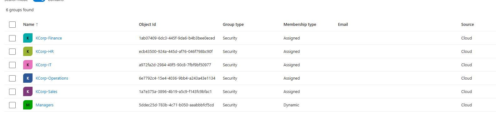
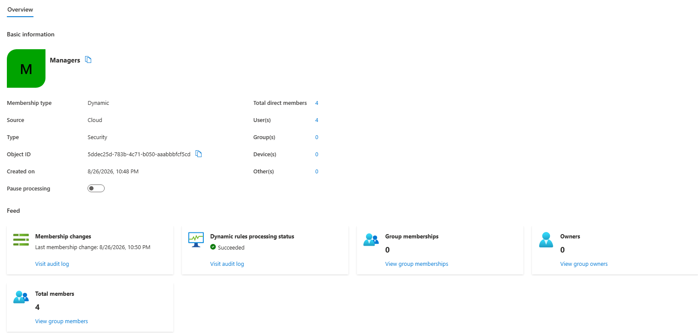

# Groups & Guest Access — KCorp Entra ID

**Date:** Late August 2026
**Phase:** Phase 0 — Accounts & Environment Setup
**Category:** Entra ID

## Goal
Close out Phase 0 by adding group structure and an external identity to the tenant — both needed as building blocks for later phases (dynamic group rules feed into access packages and CA policies in Phase 5; a guest object is needed to eventually test "require MFA for external users" style Conditional Access).

## What I Configured
- Created assigned security groups mirroring departments (KCorp-IT, KCorp-HR, KCorp-Finance, KCorp-Sales, KCorp-Operations), with matching users added to each.
- Created one **dynamic group** using a rule based on job title, targeting users with "Manager" in their title (e.g. Renee Castillo - HR Manager, Omar Haddad - Finance Manager, Tyrell Jackson - Sales Manager, Wendy Choi - Operations Manager). This pulls members automatically across departments rather than being manually assigned.
- Invited one **external/guest user** via Users → Invite external user. Status is "Invitation pending" until accepted.

## Why This Way
Went with a job-title-based rule ("contains Manager") for the dynamic group rather than a department-based one, since department-based dynamic groups would just duplicate the assigned department groups I already made. A cross-department "all managers" group is a more realistic use case — the kind of group that'd back a real access package or approval-workflow scenario later (e.g. "managers can approve access requests"), and it's a better demonstration that dynamic membership actually works across the org, not just within one filter.

The guest invite is a small step now but sets up future work — external users are a distinct identity type in Entra with different default access rules, and several later Conditional Access scenarios in the plan (Phase 5) specifically target guest/external accounts.

## How I Tested It
Confirmed each assigned group shows the correct department members. For the dynamic group, waited for membership processing to complete and confirmed it auto-populated with the expected manager-titled users across multiple departments, not just one.

## Result
Working. 6 groups total (5 assigned + 1 dynamic), dynamic group correctly picked up managers across departments without manual assignment. Guest invite sent, sitting in pending status — will confirm acceptance later or reissue if needed.

With this, **Phase 0 is fully complete**: tenant live and populated, hypervisor installed, Windows Server 2025 eval ISO downloaded, groups (including dynamic) created, guest user invited.

## Screenshots

