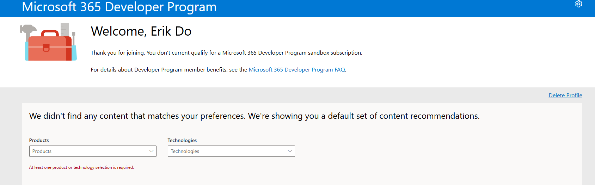
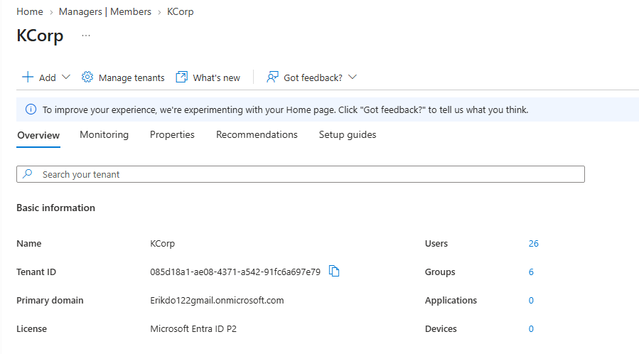

# Tenant Setup — KCorp Entra ID Environment

**Date:** Late August 2026 (retroactive entry, written after the fact)
**Phase:** Phase 0 — Accounts & Environment Setup
**Category:** Entra ID

## Goal
Get a live, populated Entra ID tenant with Entra ID P2 licensing (needed later for PIM, Identity Protection, and Access Reviews in Phase 5), to serve as the cloud identity foundation for the KCorp lab.

## What I Configured
- Initial plan was to use the Microsoft 365 Developer Program (E5 sandbox), since it's the standard free route to a P2-licensed dev tenant.
- Sign-up failed with "You don't currently qualify for a Microsoft 365 Developer Program sandbox subscription". I tried the Visual Studio Dev Essentials workaround, it did not resolve it.
- Pivoted to an Azure free account instead, which auto-creates an Entra tenant on signup.
- Renamed the tenant from "Default Directory" to **KCorp**.
- Confirmed primary tenant domain: `Erikdo122gmail.onmicrosoft.com`.
- Upgraded the tenant from Entra ID Free to a **Microsoft Entra ID P2 trial** (100 licenses, 1-month term, $0.00 — payment method required only for identity verification, not charged). Confirmed active on the Entra dashboard.

## Why This Way
The Dev Program route is the more commonly recommended path because it comes pre-licensed and pre-populated, but it's gated by an eligibility check that isn't well documented and apparently affects a meaningful number of applicants. Rather than spending more time troubleshooting an opaque eligibility system, the Azure free account route is more reliable, is 100% within my control, and gets to the same end state (a P2-licensed tenant) with an extra manual upgrade step.

## How I Tested It
Confirmed the Entra ID P2 trial shows as active on the Entra admin center dashboard, with the correct license count and term.

## Result
Working. The tenant is live under the name KCorp, and P2 licensing is active. One follow-up item: the P2 trial is time-limited (1 month, activated Aug 25, 2026).

Separately, I ran into a related issue when trying to log into admin.microsoft.com using my personal Gmail. The tenant's actual Global Admin identity is the separate `.onmicrosoft.com` cloud account, not the Gmail account used to originally sign up. This was resolved by pulling the exact UPN from the Entra Users blade and resetting/using that account's credentials directly, rather than guessing at the login.

## Screenshots

