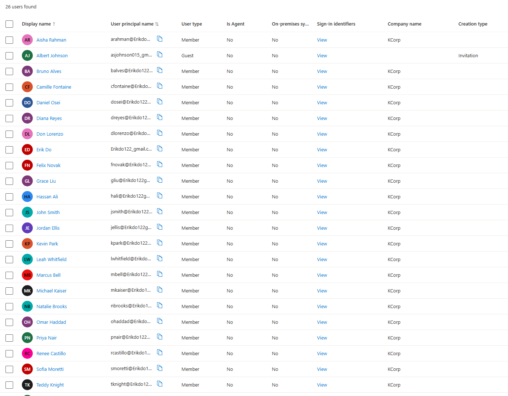
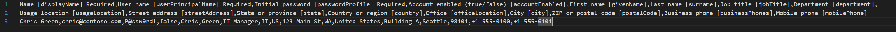

# User Provisioning — 25 KCorp Employees

**Date:** Late August 2026 (retroactive entry — written after the fact)
**Phase:** Phase 0 — Accounts & Environment Setup
**Category:** Entra ID

## Goal
Populate the KCorp tenant with a realistic set of fictional employees across departments, to have real objects to build groups, GPOs, policies, and access scenarios against in later phases.

## What I Configured
- Created 25 total users, all with Company name = KCorp, Usage location = United States.
- **First 6 created manually**, one at a time through the Entra portal, specifically to learn the manual user-creation UI before batching: Don Lorenzo, Erik Do (Global Admin, original account), John Smith (IT Support Specialist), Michael Kaiser, Teddy Knight, Vivian Hugo — one per department (IT/Finance/HR/Sales/Operations) with department-appropriate job titles.
- **Remaining 19 created via Entra's native Bulk Create (CSV import)** feature (Users → Bulk operations → Bulk create), using the provided template with columns: Name, User name, Initial password, Account enabled, First name, Last name, Job title, Department, Usage location.
- All bulk-created accounts used a placeholder password (`TempPass!2025`) and Account enabled = true.
- Final department breakdown: IT (Priya Nair, Marcus Bell, Aisha Rahman, Bruno Alves), HR (Grace Liu, Daniel Osei, Renee Castillo), Finance (Kevin Park, Sofia Moretti, Omar Haddad, Natalie Brooks), Sales (Jordan Ellis, Camille Fontaine, Tyrell Jackson, Leah Whitfield, Diana Reyes), Operations (Hassan Ali, Wendy Choi, Felix Novak).
- Two accounts were deliberately created as contractor-style accounts (Bruno Alves — IT, Diana Reyes — Sales) rather than standard employee accounts.

## Why This Way
Did the first 6 manually to actually learn the portal's user-creation flow and fields before automating — didn't want to jump straight to bulk import without understanding what it was doing under the hood. Switched to CSV bulk import for the remaining 19 because manually clicking through 19 more users has no additional learning value and bulk import is itself a skill worth having reps on (it's a realistic enterprise onboarding pattern, especially for JML/provisioning scenarios later).

Job titles were deliberately varied within each department (e.g. not every IT person is "IT Support Specialist") rather than reusing one title per department, specifically so that dynamic group rules (e.g. "job title contains Manager") have something meaningful to filter on later in Phase 5.

Contractor-style accounts were included on purpose to have a non-standard account type available for future Conditional Access / access policy scenarios (e.g. tighter policies for contractors than for full-time employees).

## How I Tested It
Confirmed all 25 users appear in the Entra Users blade with correct department and job title fields populated. Spot-checked a few of the bulk-imported accounts to confirm the CSV fields mapped correctly (name, department, title) and that Account enabled was set as expected.

## Result
Working — 25 users live in the tenant, correctly split across 5 departments with title variety. At this stage, no security groups, dynamic groups, or external/guest user existed yet — that work was intentionally sequenced after user provisioning, still within Phase 0. See `03-groups-and-guest-access.md` for that work, completed before moving into Phase 1.

## Screenshots

## Interview-Ready Summary
"I provisioned users both manually and via bulk CSV import to get reps on both patterns, and deliberately varied job titles within departments so I'd have real data to build dynamic group rules against later."
