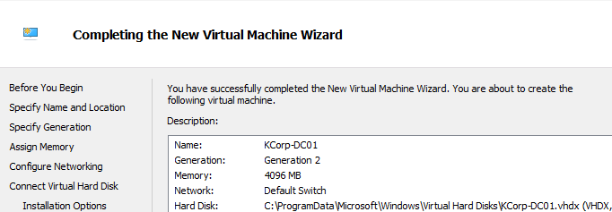
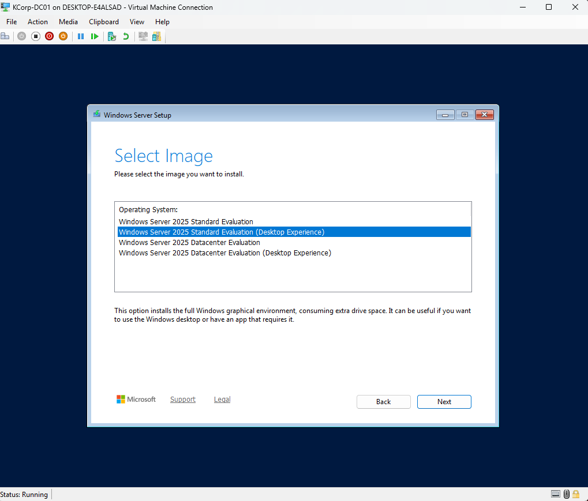
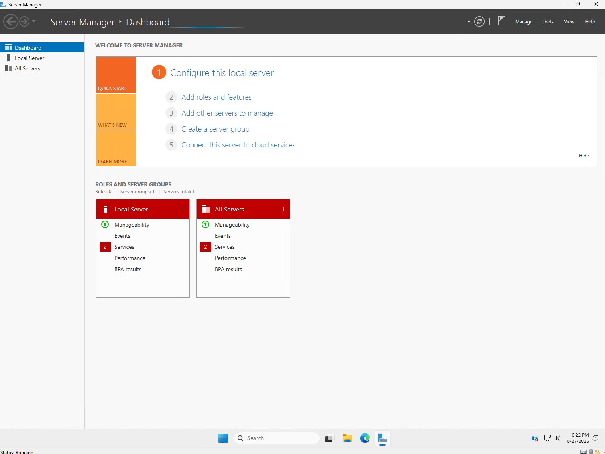
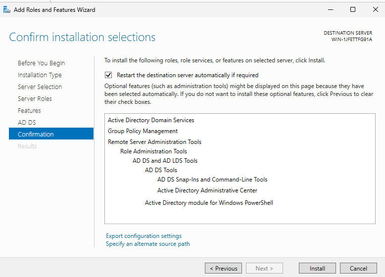
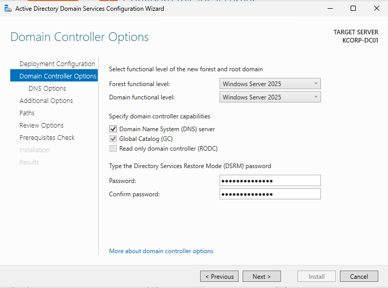
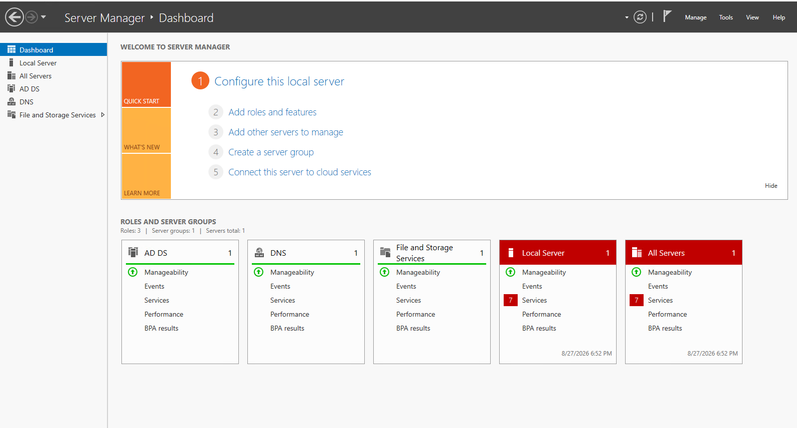

# Domain Controller Setup — KCorp-DC01

**Date:** Late August 2026
**Stage:** Stage 2 - Active Directory
**Category:** Active Directory

## Goal
Stand up the first on-premises domain controller for KCorp, establishing the `kcorp.local` domain as the foundation for on-prem AD administration. OUs, users, groups, and GPOs in later steps, and eventually hybrid sync to the existing Entra tenant later on.

## What I Configured
- Created a new VM in Hyper-V: **KCorp-DC01**, Generation 2, 4096 MB startup memory, 120GB dynamically expanding virtual hard disk, connected to **Default Switch** for network access.
- Installed **Windows Server 2025 (Desktop Experience)** from the downloaded evaluation ISO, custom install onto the fresh virtual disk.
- Renamed the server from its default auto-generated name (`WIN-1JFETTFG91A`) to **KCORP-DC01**, before promotion, to avoid the added complexity of renaming a DC after the fact.
- Installed the **Active Directory Domain Services (AD DS)** role via Server Manager → Add Roles and Features (AD DS only, left AD CS, AD FS, and AD LDS unchecked, since none of those are needed for a basic domain).
- Promoted the server to a domain controller: **Add a new forest**, root domain name **`kcorp.local`**, NetBIOS name auto-derived as **KCORP**. Left DNS Server and Global Catalog options at their defaults (both checked). Set a separate DSRM (Directory Services Restore Mode) password for disaster-recovery scenarios.
- Encountered and passed through two expected, non-blocking warnings during promotion: a DNS delegation warning (no parent zone exists to delegate from, expected for a standalone new domain) and a few Prerequisites Check warnings (all yellow/informational, no red blocking errors).
- Server rebooted automatically after promotion. Logged back in using the domain account (`KCORP\Administrator`) rather than a local-only login, confirming the domain identity took effect.

## Why This Way
Chose **Add a new forest** rather than joining an existing domain/forest, since this is the first and only DC in the environment, there is nothing to join yet.

Renamed the computer *before* promotion specifically to avoid a more complicated post-promotion rename later (renaming a live DC affects DNS records and SPNs, so it's meaningfully more work after the fact than before).

Installed only the AD DS role rather than also adding AD CS (certificate services) or AD FS (federation services). These solve different problems (internal PKI, external federation/SSO) that aren't relevant to standing up a basic domain, and adding them now would just be unused complexity for this stage of the lab.

Left DNS Server and Global Catalog checked at their defaults since both are standard requirements for a functioning single-DC domain. DNS is required for AD to operate at all, and Global Catalog is needed since this is currently the only DC in the forest.

## How I Tested It
After the post-promotion reboot, confirmed the login screen now expected a domain-context login rather than a local-only account, and logged in successfully as `KCORP\Administrator`. Opened Server Manager and confirmed AD DS now shows as an active, installed role with the server correctly listed as a domain controller for `kcorp.local`.

## Result
It is working. `KCORP-DC01` is now a functioning domain controller hosting the `kcorp.local` domain, confirmed via successful domain login and Server Manager showing the AD DS role active post-reboot. This unlocks the next steps: building out OUs, users, and groups directly in Active Directory, followed by GPOs and a domain-joined client to verify policy application.

No real issues on this pass, the DNS delegation and prerequisite warnings were expected and didn't block anything. The main lesson was sequencing the computer rename before promotion rather than after, to avoid extra complexity.

## Screenshots

