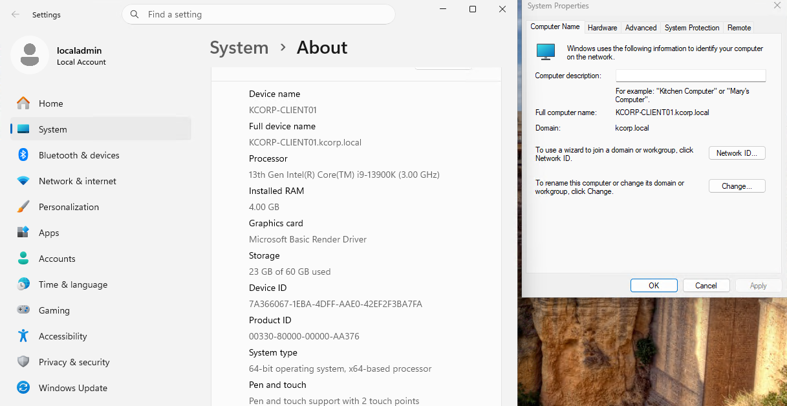
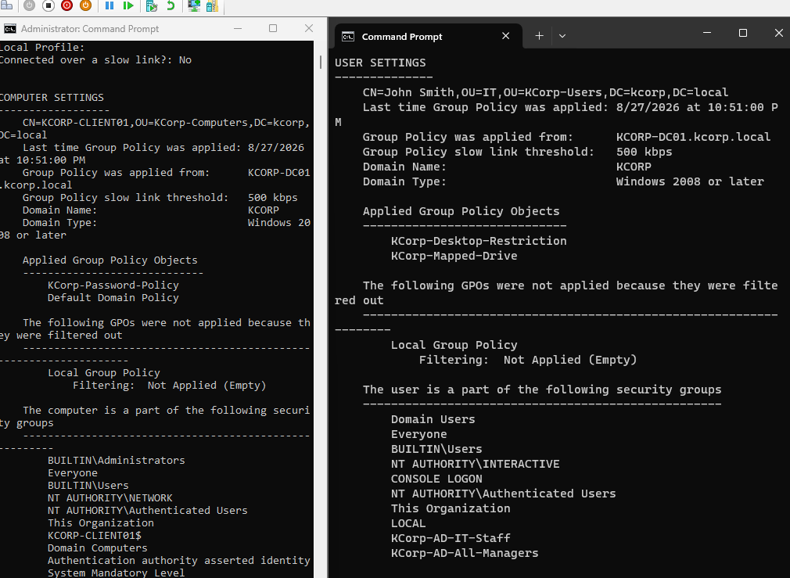

# Group Policy & Client Domain Join — KCorp

**Date:** Late August 2026
**Stage:** Stage 2 - Active Directory
**Category:** Active Directory

## Goal
Create a small set of GPOs against the OU structure, join a client VM to `kcorp.local`, and verify that the policy actually applies to a real domain-joined machine and user.

## What I Configured
- Created three GPOs and linked them to OUs in the domain:
  - **KCorp-Password-Policy** (Computer Configuration → Account Policies → Password Policy, minimum length set) — linked to `KCorp-Computers`
  - **KCorp-Desktop-Restriction** (User Configuration → Administrative Templates → Desktop, Recycle Bin icon removed) — linked to `KCorp-Users`
  - **KCorp-Mapped-Drive** (User Configuration → Preferences → Drive Maps, a mapped network drive) linked to `KCorp-Users`
- Built a second VM, **KCorp-Client01**, running Windows 11 Pro, connected to the same Hyper-V Default Switch as the DC.
- Manually set the client's DNS server to the DC's IP address (rather than leaving it on automatic/public DNS), which is required for the client to resolve `kcorp.local` and locate the domain controller at all.
- Joined the client to the `kcorp.local` domain using `KCORP\Administrator` credentials — confirmed with a successful "Welcome to the kcorp.local domain" message.
- Verified GPO application using `gpresult`, including troubleshooting why Computer Configuration settings weren't initially visible (detailed below).

## Why This Way
I split the three GPOs across Computer Configuration (password policy) and User Configuration (desktop restriction, mapped drive) deliberately, rather than putting everything under one config type. This was useful precisely because it surfaced a real distinction in how AD scopes and applies policy, described below.

I set DNS manually to the DC rather than leaving it on automatic, since a domain-joined client depends on AD-integrated DNS to locate the domain controller (SRV records, etc.). Public DNS servers have no knowledge of `kcorp.local` and domain join would fail without this.

## How I Tested It — and What Went Wrong Along the Way
Initial testing showed only User Configuration GPOs (Desktop-Restriction, Mapped-Drive). Applying Password-Policy was missing entirely from `gpresult /r` output, even though it appeared correctly linked and enabled.

**Root cause #1 — default container placement:** When a machine is joined to a domain, its computer object lands in the built-in **Computers** container by default, not in any custom OU, even though `KCorp-Computers` already existed. Since no GPOs were linked to the default Computers container, Computer Configuration settings (like the password policy) had nowhere to apply from. I fixed it by manually moving `KCORP-CLIENT01` into the `KCorp-Computers` OU and linking `KCorp-Password-Policy` there directly.

**Root cause #2 — gpresult permissions and elevation:** Even after the move and a reboot, `gpresult /r` still didn't show Computer Configuration results. This turned out to be a permissions issue with the tool itself, not the GPO: a non-elevated `gpresult /r` silently omits Computer Configuration RSoP data. Running it fully elevated as `KCORP\Administrator` produced a different error ("the user does not have RSoP data"), since that account had never interactively logged into the client and had no cached policy data to report on for a user-scoped query. The fix was running an elevated Command Prompt (elevated via `KCORP\Administrator` credentials) with the command scoped explicitly to computer data only:
```
gpresult /r /scope:computer
```
This successfully showed `KCorp-Password-Policy` applying correctly under Computer Settings, confirming the GPO had been working correctly the entire time. The visibility issue was entirely a `gpresult` scope/permissions quirk, not a misconfiguration.

## Result
All three GPOs confirmed applying correctly:
- **Computer Settings:** KCorp-Password-Policy, Default Domain Policy
- **User Settings:** KCorp-Desktop-Restriction, KCorp-Mapped-Drive

Domain join, DNS resolution, OU-scoped policy application, and group nesting (KCorp-AD-IT-Staff nested in KCorp-AD-All-Managers) all verified working end-to-end on a real domain-joined client and user. This completes the Active Directory Stage: working domain, OUs, users, groups, GPOs, and a domain-joined client with confirmed policy application.

The most valuable outcome of this step wasn't the GPOs applying cleanly. It was hitting two genuine, common real-world AD issues (default computer container placement, and `gpresult` elevation/scope behavior) and working through them methodically rather than assuming something was broken.

## Screenshots


