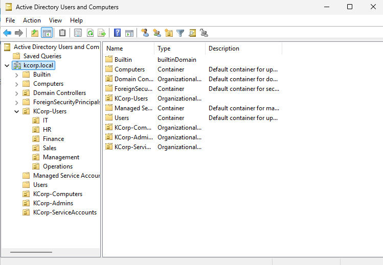
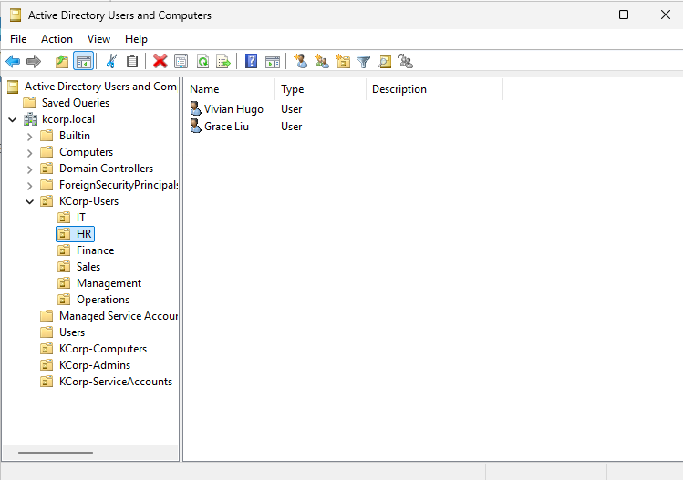
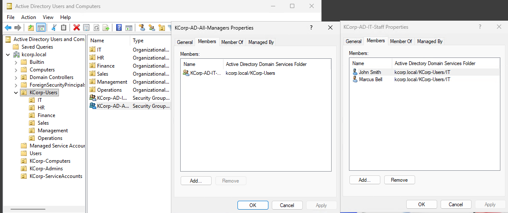

# OU Structure, Users & Group Nesting — KCorp On-Prem AD

**Date:** Late August 2026
**Stage:** Stage 2 - Active Directory
**Category:** Active Directory

## Goal
Populate the newly promoted `kcorp.local` domain with an organizational structure, a representative set of users, and security groups demonstrating nesting. The on-prem counterpart to the department/user structure is already built in the Entra tenant, and the foundation GPOs will be linked next.

## What I Configured
- Built an OU structure under `kcorp.local`:
  - **KCorp-Users**, with six department sub-OUs: IT, HR, Finance, Sales, Management, and Operations, matching the department structure already in place in the Entra tenant
  - **KCorp-Computers**
  - **KCorp-Admins**
  - **KCorp-ServiceAccounts**
- Created AD users manually (via ADUC → New → User) inside the department sub-OUs, 2 users per department across all six departments (12 users total), to demonstrate manual on-prem provisioning without needing to duplicate the full 25-user Entra roster.
- Created two security groups (Global scope, Security type):
  - **KCorp-AD-IT-Staff**: Populated with the IT department's users specifically
  - **KCorp-AD-All-Managers**: Populated by nesting **KCorp-AD-IT-Staff** inside it as a member, rather than adding individual users directly

## Why This Way
Used the fuller OU structure (department sub-OUs plus separate Computers/Admins/ServiceAccounts containers) rather than a single flat OU, since purpose-built OUs are both more realistic for a real enterprise and a better demonstration of deliberate AD design. `KCorp-Admins` and `KCorp-ServiceAccounts` being separated out supports more targeted GPOs and delegation later, rather than lumping every object type together.

Kept department group membership scoped tightly (`KCorp-AD-IT-Staff` = actual IT users only, not a mix) rather than adding unrelated users, since a group's membership should map to a clear role.

For the nesting demonstration, I nested the IT-Staff group *inside* the All-Managers group instead of adding individual users to both. This demonstrates the actual nesting mechanic (a group inheriting membership from another group) more cleanly than a real-world "who is an actual manager" story would, and keeping the demo mechanically simple was more useful here than a fully realistic scenario.

## How I Tested It
Confirmed each department sub-OU contains its assigned users by browsing the OU tree in ADUC. Confirmed nesting worked correctly by opening `KCorp-AD-All-Managers` → Members tab and verifying `KCorp-AD-IT-Staff` appears as a member (a group, not a user), proving the group-in-group relationship was set up correctly rather than just visually similar.

## Result
It is working. Six department sub-OUs populated with 12 users total (2 per department), plus three additional structural OUs (Computers, Admins, ServiceAccounts) ready for later use. Two security groups exist with a confirmed nesting relationship. This sets up the structure that GPOs will be linked to next, and the department/OU layout is now consistent between the on-prem AD side and the existing Entra tenant.

## Screenshots

