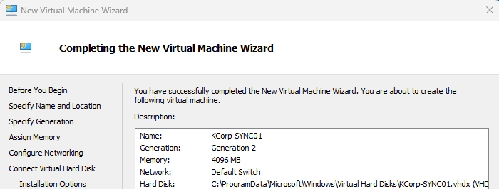
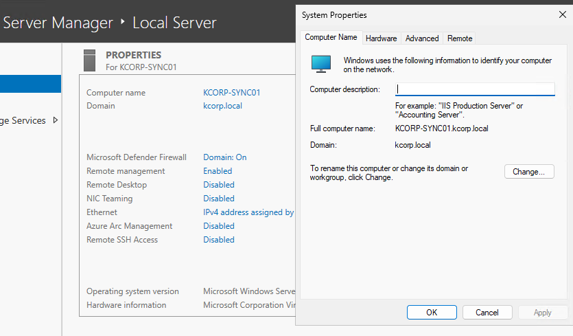
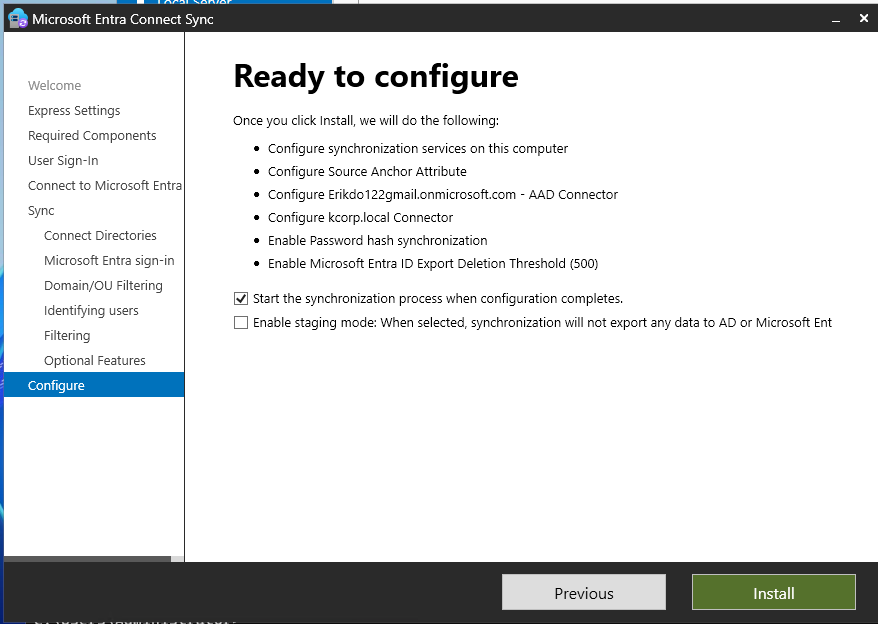
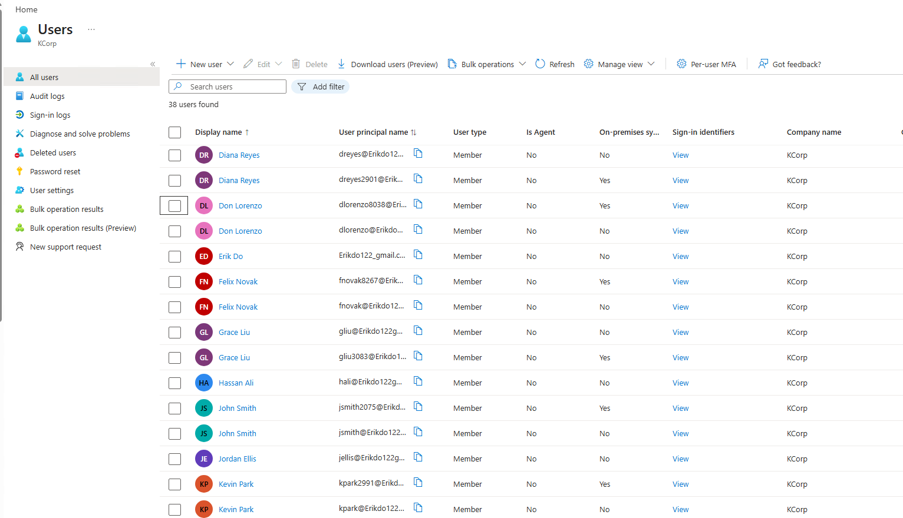
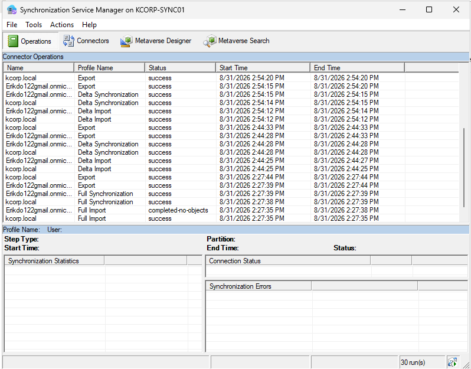
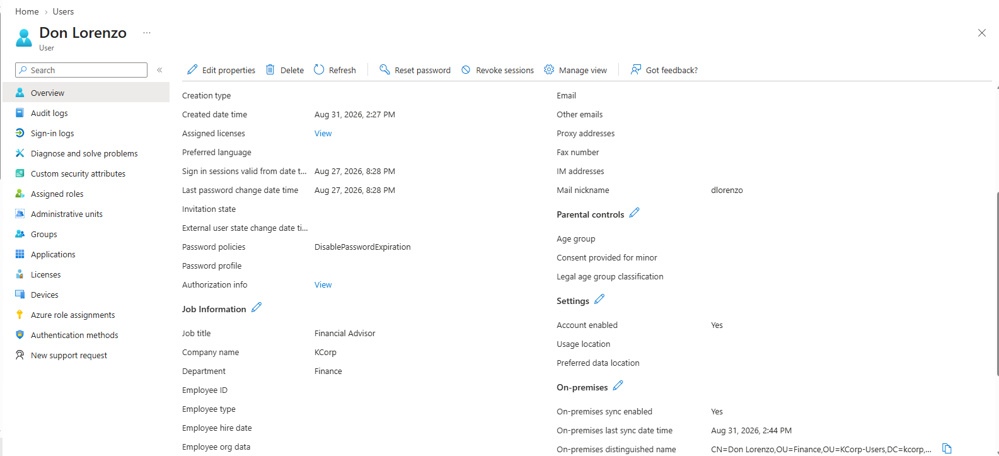
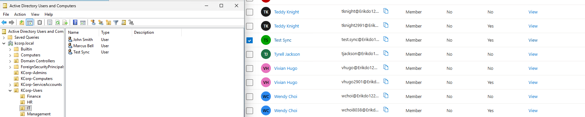
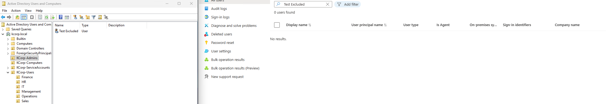

# Hybrid Identity — Microsoft Entra Connect Setup

**Date:** Late August 2026
**Stage:** Stage 3 - Hybrid Identity
**Category:** Hybrid Identity

## Goal
Bridge the on-prem `kcorp.local` Active Directory environment (built in the Active Directory stage) to the existing KCorp Entra ID tenant (built in the Entra ID stage), establishing a real hybrid identity environment, with on-prem AD as the source of truth, syncing to the cloud via Microsoft Entra Connect.

## What I Configured
- Built a dedicated VM, **KCorp-SYNC01** (Windows Server 2025, 4GB RAM), domain-joined to `kcorp.local`, separate from the DC. I chose this over installing Entra Connect directly on the domain controller to keep sync infrastructure isolated the way it typically is in real environments.
- Configured DNS forwarding on **KCorp-DC01** (added 8.8.8.8, 8.8.4.4, and 1.1.1.1 as forwarders) after discovering that clients using the DC as their only DNS server couldn't resolve public internet addresses. The DC needed to forward unknown lookups externally.
- Downloaded Microsoft Entra Connect directly from the Entra admin center (Entra ID → Entra Connect → Get Started → Manage → Download Connect Sync Agent). Noting that Microsoft has moved this off the traditional Download Center and now distributes it exclusively through the admin center.
- Ran a **Customize** installation (not Express), to make each configuration decision deliberately:
  - Left all optional install components (custom SQL, custom service account, custom sync groups) at default. A full lab-scale install doesn't need any of these
  - Selected **Password Hash Synchronization** as the sign-in method
  - Connected to the Entra tenant using the Global Admin cloud account
  - Connected to the on-prem `kcorp.local` forest, Entra Connect rejected using `KCORP\Administrator` directly as the ongoing sync account (Domain/Enterprise Admin accounts aren't permitted for this by design), so I let the installer auto-create a dedicated, properly-scoped sync service account instead
  - On the UPN suffix screen, `kcorp.local` showed as "Not Added" against Microsoft Entra ID, since it isn't a publicly verifiable domain. I selected "Continue without matching all UPN suffixes to verified domains," which is the standard, supported option for an internal-only AD domain like this one. Entra Connect maps synced users to the tenant's verified default domain instead.
  - On domain/OU filtering, selected "Sync selected domains and OUs" and scoped to **KCorp Users only** (which includes all six department sub-OUs). I had to actively uncheck several other pre-selected containers first (see below)
  - Left user/device filtering at "Synchronize all users and devices" (scope was already controlled at the OU level)
  - Left all optional features (Exchange hybrid, password writeback, group writeback, etc.) unchecked, none apply to this phase
- Ran the initial sync, then triggered additional delta syncs as needed using:
  ```
  Start-ADSyncSyncCycle -PolicyType Delta
  ```

## Why This Way
I used a dedicated sync server rather than installing on the DC to mirror how sync infrastructure is typically isolated in real environments, and to avoid adding load or risk to the domain controller itself.

On the OU/domain filtering screen, the default selection had nearly every container checked, including system containers like Builtin, System, Infrastructure, ForeignSecurityPrincipals, Managed Service Accounts, and Program Data, plus Domain Controllers and the default Users container. Left unchecked, this would have synced internal AD service objects and computer accounts into Entra alongside real users, not a clean or intentional picture of the organization. I deliberately unchecked everything except **KCorp Users**, so only the actual department users and their sub-OUs sync.

I chose "continue without matching UPN suffixes" over trying to add `kcorp.local` as a verified domain, since `kcorp.local` is an internal-only lab domain with no real public DNS to verify ownership against. The unmatched-suffix path is the correct, supported route for this exact scenario, not a workaround.

## How I Tested It — and What I Found Along the Way
After the initial sync, checking the Entra Users blade surfaced two real findings, not failures:

**Duplicate user objects:** Existing cloud-only users created in the Entra ID stage (e.g., John Smith) and their newly synced on-prem counterparts both now exist in Entra as separate objects. Entra Connect has no inherent way to know these represent the same person unless explicit user-matching is configured, which wasn't part of this pass. This is a known real-world hybrid identity issue for organizations that build cloud-first and add on-prem sync later.

**Missing Department/Job Title on synced users:** The synced (on-prem-sourced) user objects initially showed no Department or Job Title, while the original cloud-only objects had this data. Root cause: those fields were never populated on the on-prem AD user objects when they were created in Phase 1. Entra Connect only syncs what actually exists on-prem, it doesn't infer or backfill missing data. Fixed by populating Department/Job Title on the on-prem AD Organization tab for all users, then running a delta sync to push the update through. This also became the basis for the attribute-change verification test below.

**Three verification tests, run to confirm sync behavior rather than just assuming it worked:**
1. **New user sync test**: Created a new on-prem AD user (`test.sync`) inside an included OU (`KCorp-Users → IT`), ran a delta sync, confirmed the user appeared in Entra with On-premises sync = Yes.
2. **Attribute change test**: Updated Department/Job Title on-prem for existing synced users, ran a delta sync, confirmed the updated values appeared correctly in Entra.
3. **Excluded OU test**: Created a new on-prem AD user inside `KCorp-Admins` (an OU deliberately left out of the sync scope), ran a delta sync, confirmed the user did **not** appear in an Entra Users search, proving the OU filter is actually enforcing scope, not just configured for show.

## Result
Working hybrid identity environment: `kcorp.local` syncing to the KCorp Entra tenant via Password Hash Synchronization, scoped specifically to real user OUs. Sync verified through Synchronization Service Manager showing successful operations, and through all three deliberate tests behaving exactly as expected. Inclusion, attribute propagation, and exclusion all confirmed rather than assumed.

This completes the Hybrid Identity stage and the three foundational pieces of the KCorp lab: Entra ID, on-prem Active Directory, and now hybrid identity connecting the two.

## Screenshots








